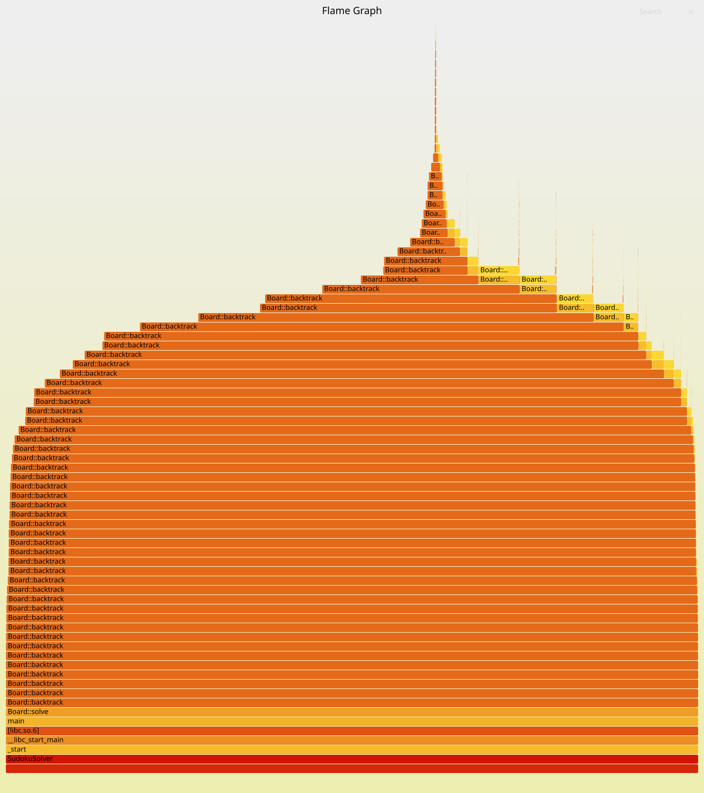

# Izveštaj analize projekta — SudokuSolver

## Uvod
Cilj rada je praktična primena različitih alata i tehnika za verifikaciju softvera obrađenih na kursu (poput testiranja, statičke analize, profajliranja i drugih pristupa dinamičkoj i statičkoj proveri koda). Kao projekat nad kojim će se demonstrirati korišćenje alata odabran je projekat otvorenog koda - SudokuSolver.

U nastavku izveštaja detaljno su opisani korišćeni alati, način njihove primene, dobijeni rezultati i zaključci izvedeni iz analize.

## 1. Jedinični testovi i pokrivenost koda
### Testiranje
Kao prvi alat korišćen je GoogleTest, za testiranje:
- javnih metoda klase `Board`: `load`,`isSolveable`, `solve`, `print`
- pomoćnih metoda za indeksiranje: `translate`, `getRow`, `getColumn`, `getTileSquare`

Testovi se nalaze u `unit_tests/tests/`, podeljeni po fajlovima:
- `test_board_load.cpp`: učitavanje ispravnog, nepostojećeg fajla, kao i fajla sa belinama i fajla pogrešne dužine
- `test_board_indexing.cpp`: indeksna aritmetika, 
- `test_board_solve.cpp`: rešavanje easy/hard/world_hardest/not_solveable table i provera duplikata u redu koloni/kvadratu 
- `test_board_print.cpp`: ispis table, presretanjem `std::cout`

Za slučajeve kojih nema među gotovim primerima projekta, napravljeni su ručni test fajlovi u `unit_tests/fixtures/`. 

**Rezultat: 17/17 testova prolazi.**

**Napomena**: Tokom pisanja testova za ideksiranje, primetila sam da kompajler prijavljuje upozorenje da su `translate`, `getRow`, `getColumn` i `getTileSquare` deklarisane kao `inline` u `Board.h`, ali im je definicija u `Board.cpp`, a ne u header-u, što tehnički nije ispravno za `inline` funkcije. Build i dalje prolazi jer se linkuje preko `engine` biblioteke, ali je ovo propust u originalnom kodu.

### Pokrivenost koda
Pokrivenost je merena pomocu alata `lcov`. Prilikom generisanja izveštaja javila se greška `(inconsistent) mismatched end line`, zbog novije verzije `gcov`-a koju sam koristila. Ovo sam rešila dodavanjem `--ignore-errors inconsistent` u `run_coverage.sh`.

Pokrivenost `Board.cpp` i `SolveResult.cpp`:
- Board.cpp: **100%**
- SolveResult.cpp: **100%**

Funkcija `Board::print()` nije odmah bila pokrivena nijednim testom, pa sam dodala test koji presreće `std::cout` da proveri ispis.

Reprodukcija:
```bash
./unit_tests/run_tests.sh
./unit_tests/run_coverage.sh
xdg-open unit_tests/coverage/index.html
```

## 2. Fuzz testiranje (libFuzzer)

Kao drugi alat u analizi korišćen je **libFuzzer**, coverage-guided fuzzer koji dolazi uz Clang. 
Fuzzing, za razliku od jediničnih testova, sam generiše veliki broj nasumičnih ulaza i prati koje linije koda su pogodili. 
Kad naiđe na ulaz koji otkrije neki novi deo koda, dalje ga izmenjuje taj ulaz.

Testirana je funkcija `Board::load()`, jer je to jedino mesto u programu gde ulazi  potencijalno nepouzdan podatak, tj. sadržaj fajla koji korisnik zada programu. 
Sve ostalo u kodu radi nad podacima koji su već prošli kroz `load()`, pa se pretpostavlja da su validni.

Pošto `load()` prima putanju do fajla, a ne sirove bajtove, napisan je mali harnes (`fuzzing/fuzz_board_load.cpp`) koji upisuje fuzz ulaz u privremeni fajl i tek onda poziva `load()` nad njim (ne dira se originalni kod).  
Harnes je kompajliran sa `-fsanitize=fuzzer,address`, gde `fuzzer` ubacuje sam libFuzzer engine, a `address` (AddressSanitizer) hvata memorijske greške (npr. čitanje van granica niza) čim se dese, ne nakon pada programa.

Kao seed korpus (početni primeri od kojih fuzzer kreće mutacije) korišćeni su  gotovi primeri `SudokuSolver/content/sudokus/`.

### Rezultat
Prvo je pokrenut kratak probni run (60s) kako bih potvrdila da harnes radi ispravno:  
`#153005 DONE   cov: 387 ft: 1269 corp: 121/9114b lim: 1026 exec/s: 2508 rss: 466Mb`  

Nakon toga, ponovo sam pokrenula, ali u trajanju od 30 minut (1800s):  
`#4209181        DONE   cov: 387 ft: 1275 corp: 112/8576b lim: 4096 exec/s: 2337 rss: 471Mb`


* Oba pokretanja bila su bez ijednog crash-a ili ASan greške
* Pokrivenost (`cov`) je ostala na 387 linija u oba run-a
* Broj features je malo porastao (ft: 1269 -> 1275), što znači da je duži run otkrio neku dodatnu putanju kroz kod

**Reprodukcija**
```bash
./fuzzing/run_fuzz.sh 60      
./fuzzing/run_fuzz.sh 1800    
```

**Zapanimljivost** Tokom dužeg run-a, libFuzzer je sačuvao jedan "spor" ulaz (`fuzzing/slow-unit-1286b4e7f143cc814ffc44c392d576b23e0fd5b8`), tj. taj ulaz je u jednom trenutku obrađen sporije nego ostali u tom momentu, pa ga je libFuzzer automatski izdvojio. Kada sam taj isti fajl pokrenula zasebno ponovo izvršio se za 3ms. To znači da usporenje nije bilo zbog problema u kodu, već verovatno zbog opterećenja sistema. 

### Zaključak
`Board::load()` je stabilan na proizvoljan ulaz, na osnovu toga što se nije desio nijedan crash ni ASan greška u velikom broju pokušaja.  
Jedini sumnjiv nalaz (spor ulaz) se pri proveri pokazao kao lažna uzbuna, a ne stvaran problem u kodu.

## 3. Profajliranje (perf)

Originalni CLI program je izgrađen u zasebnom build direktorijumu (`build-perf/`) sa `-O2 -g-fno-omit-frame-pointer`  što daje realne performanse ali tako da perf ima sačuvana imena funkcija kako bi se ispisivao čitljiv graf.

Prvo sam izmerila vreme izvršavanja nad dostupnim primerima sudoku-a:
 * easy: 211 backtrack-ova, real time: 0.007s
 * hard: 318439 backtrack-ova, real time: 0.031s
 * world haredst: 72015 backtrack-ova, real time: 0.009s
 * anti backtracking: 88178481 backtrack-ova, real time 9.280s

Za ulaz je korišćen sudoku primer `anti_backtracking.txt`, jer je vremenski najzahtevniji.

Uporedila sam dva perf run-a: probni na `hard.txt` koji daje 133 uzorka i glavni run na `anti_backtracking.txt` koji daje 40K uzorka. 

### Očekivanja
Očekuje se da će usko grlo biti `backtrack()` funkcija, jer rekurzija nosi veliku složenost. Zanimljivo je analizirati koliki deo tog troška ide na logiku unutar rekurzije `isRowInsertionValid`, `isColumnInsertionValid` i `isSquareInsertionValid` jer se te funkcije se pozivaju pri svakom
pokušaju upisivanja vrednosti. 

### Rezultati
Ceo izveštaj se može naći u fajlu `anti_backtracking.report`. 
                                                                
* Skoro sav trošak programa je pripisan funkciji `Board::backtrack()`. Ona nosi 99.98% Children i 99.39% Self vremena (linija 688)
* `Board::isTileInsertionValid()` (linija 1139) i `Board::isRowInsertionValid()` (linija 1144) su označene sa `(inlined)`, svaka sa 37.06% Children i 0.00% Self
* `Board::translate()` (linija 1155), `std::vector<Tile>::size()` (linija 1159) i `std::vector<Tile>::operator[]()` (linija 1162) su takođe inlinovane, svaka sa manje od 0.4% Children
* Znači validacione funkcije jesu trošile vreme. Zbog optimizacije ih je kompajler ubacio u telo `backtrack()`, pa na mašinskom nivou  ne postoje kao odvojeni pozivi

### Flame graph  
Tekstualni frame report je prikazan flame grafom. Grafik se nalazi u `perf/perf-outputs/anti_backtracking.svg`. Grafik se nalazi u `perf/perf-outputs/anti_backtracking.svg`. Vizuelno se vidi jedna uska, vrlo visoka "kula" koju čine ugnježdeni pozivi `Board::backtrack()`.



## 4. Clang Static Analyzer (scan-builder)

Kao prvi alat statičke analize korišćen je scan-build koji je deo clang paketa. Scan-build je pokrenut nad celim projektom.

**Rezultat**: `No bugs found`  
Ovo je očekivano jer je projekat mali (sadrži dva .cpp fajla), ne korsti dinamičku alokaciju, nema složenih grananja. 
Tekstualni izlaz komande sačuvan je u `static-analysis/scan-build/scan-build.log`

**Reprodukcija**: `./static-analysis/scan-build/run_scan_build.sh`

## 5. cppcheck

Drugi alat koji je koršćen za statičku analizu je cppcheck. Ovaj alat ne kompajlira kod. 

Pokrenut je sa sledećim opcijama:
* `--enable=all` kako bi se pokrila šira slika (ne samo errori) već i style, performance, portability i warning kategorije. 
* `--inconclusive` kako bi se uzeli u obzir i potencijalni  problemi u koje alat nije 100% siguran
* `--std=c++14` zbog sintakse, projekat je pisan u C++14 
* `--force` garantuje potpunu pokrivenost, a kako je ovo mali projekat to nije problem
* `--suppress=missingIncludeSystem` da se uklone zaglavlja poput <vestot>, <string> koja cppcheck ne ume da razreši 

**Rezultat**: 4 zapažanja
* `functionStatic` -  Board::getRow, Board::getColumn i Board::translate ne koriste nijedan član klase, pa mogu biti statičke
* `constVariableReference` -  u Board.cpp:41, promenljiva c u for (auto &c : buffer) se ne menja, pa bi trebalo da bude const auto &c.

Rezultat se može pročitati u: `static-analysis/cppcheck/report.txt`

**Reprodukcija**
`./static-analysis/cppcheck/run_cppcheck.sh`

## 6. clang-tidy

Treći alat statičke analize je clang-tidy. Ovaj alat kompajlira kod (koristi compile_commands.json, argument pri kompilacji -DCMAKE_EXPORT_COMPILE_COMMANDS=ON)

Konfigurisan je preko `.clang-tidy` fajla, sa sledećim grupama provera:
* `bugprone-*` – sumnjivi obrasci koji često dovode do bagova
* `performance-*` – neefikasan kod
* `modernize-*` – zastareo stil, mogao bi da koristi noviji C++
* `readability-*` – čitljivost koda

Pokrenut je nad `Board.cpp`, `SolveResult.cpp` i `Main.cpp`.

**Rezultat**: 109 upozorenja u korisničkom kodu. Alat je izostavio 10412 upozorenja iz sistemskih header-a, koja nisu relevantna.

Najčešće kategorije:
* `modernize-use-trailing-return-type` - stilska preporuka, ne utiče na ispravnost
* `readability-identifier-length` - imena parametara kao `c`, `r` prekratka (< 3 karaktera)
* `readability-braces-around-statements` - predlagaže vitičaste zagrade 
* `performance-avoid-endl` - korišćenje `std::endl` umesto `\n`

Vredniji nalazi:
* `bugprone-easily-swappable-parameters` u `Board::getTileSquare(column c, row r)` (Board.cpp:228). Column i row su samo alijasi za unsigned int, pa tip ne štiti od zamene mesta argumentima, a  to bila logička greška. 
* `bugprone-narrowing-conversions` (Board.cpp:29) konverzija iz 'size_type' u signed type streamsize zavisi od implementacije 

**Reprodukcija**
```bash
./static-analysis/clang-tidy/run_clang_tidy.sh
```

## 7. Mull - testiranje mutacijom testova

Korišćen je alat [Mull](https://mull.readthedocs.io/). Ovaj alat ne analizira kod projekta već kvalitet napisanih testova.  
Za pokrivenost koda dobia sam 100% pokrivenost i za Board.cpp i za SolveResult.cpp. Pokrivenost meri da li je neka linija izvršena tokom testiranja, a ne i da li testovi primećuju da li je ta linija pogrešna ili ne. Mull pravi mutirane kopije programa (sa nekom namernom izmenom, npr. promena znaka aritmetike, ili uslova poređenja) i za svaku kopiju pokreće ceo skup napisanih testova.  
Mutant je **ubijen** ako testovi padnu (testovi su primetili problem), a ako testovi i dalje prolaze mutant je **preživeo** (nijedan test nije primetio problem).

### Postupak
1. Board.cpp i SolveResult.cpp se prevode u LLVM bitkod
2. mull-instrument-22 ubacuje mutante u bitkod
3. mutirani bitkod se prevodi u objektne fajlove
4. test fajlovi se prevode standardno tj. testovi se ne mutiraju
5. sve se linkuje sa GoogleTest bibliotekama
6. mull-runner-22 izvršava mutante i generiše izveštaje

Korišćene su četiri grupe mutatora:
* cxx_comparison
* cxx_boundary
* cxx_arithmetic 
* cxx_calls

Poretanje skripteČ `mutation-testing/run_mull.sh`, a konfiguracija se nalazi u `mutation-testing/mull.yml`.


### Rezultat
* Ukupno mutanata: 83
* Ubijeni: 62
* Preživeli: 21
* Mutation score: 74%
* Svi mutanti su u Board.cpp. 
* Ceo izveštaj se nalazi u mutation-testing/report/sudoku.txt.

### Analiza preživelih mutanata
* Board.cpp:80:12: warning: Survived: Replaced == with !=   
obrće uslov rekurzije i zapravo odmah na pocetku postavlja da je solved=true. Testovi samo proveravaju da li je sudoku rešen (result.solved=true, a tabla je prazna). Testvoi ne gledaju sadržaj rešenja.
* Board.cpp:80:22: warning: Survived: Replaced size with 42  
Slično kao prethodno, samo se popuni prvih 42 polja, a ostali ostanu kako su učitani iz fajla
* Board.cpp:88:30: warning: Survived: Replaced < with <=  
Originalna petlja ide od 0 do 9 i upisuje vrednost i+1. Zamenom sa <= može se upisati vrednost 10 koja u igri sudoku nije validna. Razlog zašto testovi ne padaju je jer oni samo proveravaju da li je sudoku rešen.
* Board.cpp:129:23: warning: Survived: Replaced < with >=  
U funkciji isRowInsertionValid, uslov postaje 0>=9, pa se telo petlje ne izvršava. Nijedan test ne pada, jer sam u duplicate_in_row.txt duplikate stavila u istom kvadratu. Tako da ovu grešku hvata test koji proverava da li se dva broj nalaze u istom kvadratu. Ovaj se ovaj mutant ubio duplikat mora biti u istom redu, ali u različitim kvadratima.
* Board.cpp:148:20: warning: Survived: Replaced < with >=  
Isto samo za duplikate u koloni.
* Preostali mutanti preživlojavaju iz istog razloga - testovi za ispis proveravaju samo postojanje znakova za ispis `| _ -`. Ne proveravaju koliko ih ima, ni gde se nalaze. Zato mutacije koje pomeraju separatore menjaju izgled table, a nijedan test to ne primeti.

### Zaključak
Visoka pokrivenost koda nije garancija kvaliteta testova. Uprkos potpunoj pokrivenosti linija utvrđenoj u sekciji 1, mutaciono testiranje je pronašlo mesta u kodu koje postojećih 17 testova ne proverava.